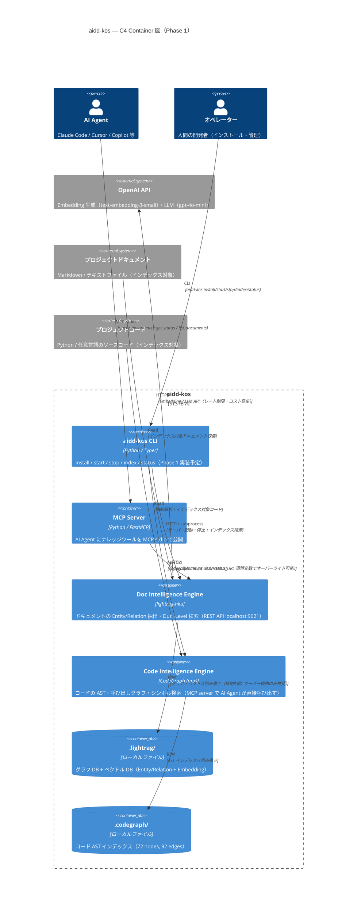

# アーキテクチャ基盤（ArchitectureBaseline）

| 項目 | 内容 |
|------|------|
| バージョン | 1.0.0 |
| 作成日 | 2026-06-03 |
| 技術スタック | Python 3.12 / FastMCP / LightRAG / Typer / CodeGraph |
| SRE レビュー完了日 | 2026-06-03 |
| 対象 Phase | Phase 1（Core MVP）|

## C4 Container 図

C4 Model Level 2: Container 図（Phase 1 現在の構成）



### Phase 2〜 への拡張

Phase 2（Multi-Engine）では MCP Server が複数の Knowledge Engine をツールとして公開する。
CodeGraph は既に Phase 1 で稼働しているが、MCP ツールとしての公開は Phase 2 で実施する。

```text
[AI Agent]
    ↓ MCP stdio
[MCP Server (FastMCP)]
    ↓ (Agent が選択)
+-----------------------------------+
|  Doc Intelligence (LightRAG)      |
|  Code Intelligence (CodeGraph)    |
|  Future Engine N                  |
+-----------------------------------+
```

## レイヤー構成

採用パターン: **レイヤードアーキテクチャ**（Presentation → Application → Domain → Infrastructure）

| レイヤー | 責務 | 現実装モジュール | 依存先 | 禁止依存 |
|--------|------|--------------|--------|---------|
| **Interface Layer**（インターフェース層） | MCP ツール公開（FastMCP）・CLI コマンド（Typer）。入出力変換のみ、ビジネスロジックなし | `mcp_server/server.py`（MCP）、`aidd_kos/cli.py`（未実装） | Application Layer | Domain / Infrastructure への直接アクセス禁止 |
| **Application Layer**（アプリケーション層） | クエリ統括・インデックス管理・サーバーライフサイクル管理 | `scripts/index.py`、`scripts/server.py`、`scripts/stop.py`、`scripts/status.py` | Knowledge Engine Layer | Infrastructure への直接アクセス禁止 |
| **Knowledge Engine Layer**（ナレッジエンジン層） | Doc Intelligence（LightRAG）・Code Intelligence（CodeGraph）の知識処理・検索・グラフ操作 | LightRAG REST API（外部プロセス）、CodeGraph（外部プロセス） | Infrastructure Layer | Interface / Application への逆依存禁止 |
| **Infrastructure Layer**（インフラ層） | OpenAI API クライアント・LightRAG REST API クライアント・ファイルシステムアクセス | `httpx`（LightRAG HTTP）、`urllib.request`（LightRAG REST）、LightRAG 内部 OpenAI クライアント | 外部サービス（OpenAI API / ファイルシステム） | 上位レイヤーへの逆依存禁止 |

> **注記（N-5）:** 現 Phase 1 実装では Interface Layer が直接 Infrastructure（httpx 経由の LightRAG REST API）を
> 呼び出しており Application Layer が薄い。Phase 2 のエンジン追加時にリファクタリングを実施する。

## 依存方向ルール

```text
Interface Layer
    ↓（呼び出し可）
Application Layer
    ↓（呼び出し可）
Knowledge Engine Layer
    ↓（呼び出し可）
Infrastructure Layer
    ↓（呼び出し可）
外部サービス（OpenAI API / ファイルシステム）
```

- **逆方向依存（↑）は禁止**。下位レイヤーは上位レイヤーを知らない
- Knowledge Engine Layer（LightRAG / CodeGraph）は外部プロセスとして動作するため、Application Layer はプロセス間通信（HTTP / npx CLI）でのみ呼び出す

## 既知の技術的負債（SRE レビュー指摘）

| ID | 指摘 | 場所 | 対処方針 |
|----|------|------|---------|
| TD-01 | `httpx.AsyncClient(timeout=60)` が NFR P95 < 2秒と乖離。タイムアウトが NFR 違反を検知できない | `mcp_server/server.py` L34 | 環境変数 `LIGHTRAG_QUERY_TIMEOUT_MS`（デフォルト 5000ms）でオーバーライド可能にし、タイムアウト時に `{"error": "QUERY_TIMEOUT"}` を返す。Phase 1 完了前に対応 |
| TD-02 | MCP ツール層でのエラーが stderr に出力されず NFR（3 秒以内 stderr 出力）に不適合 | `mcp_server/server.py` except 節 | MCP ツールのエラーハンドラーで `sys.stderr.write()` によるエラーコード + 対処方法を出力。Phase 1 完了前に対応 |
| TD-03 | インデックスの二重書き込み経路（REST API / Python API 直接）による競合リスク。サーバー起動中の Python API 経路はインデックス破損の可能性 | `scripts/index.py` L100-117 | サーバー起動中は Python API 直接経路を禁止（`sys.exit(1)` で明示失敗）し、ADR として設計判断を記録。Phase 2 前に対応 |
| TD-04 | `aidd-kos` CLI（Typer）が未実装。C4 図には記載済みだが `pyproject.toml` にエントリポイントなし | `pyproject.toml` | Phase 1 完了条件として CLI 実装を追加。`aidd_kos/cli.py` を新規作成し `pyproject.toml` にエントリポイントを登録する |

## Analysis Notes

### 確認したファイル

| ファイル | 確認内容 |
|---------|---------|
| `docs/PROJECT-CHARTER.md` | §9 アーキテクチャ方針・§10 技術スタック・NFR を取得 |
| `mcp_server/server.py` | MCP ツール定義・httpx タイムアウト・エラーハンドリングを確認 |
| `scripts/index.py` | インデックス二重経路・忽視パターンを確認 |
| `scripts/server.py` | LightRAG サーバー起動・PID 管理を確認 |
| `Taskfile.yml` | codegraph:* タスク・lightrag:* タスクが既に実装済みであることを確認 |
| `pyproject.toml` | 依存パッケージ・エントリポイントを確認 |

### 存在しないファイル

- `aidd-framework/conventions/python.md` — Python 固有の規約ファイルなし。フレームワーク共通規約を適用
- `docs/domain/bounded-contexts.md` — ドメイン設計未定義
- `docs/architecture/adr/` — ADR 未作成（.gitkeep のみ）
- `docs/project-conventions/overrides.md` — プロジェクト固有規約オーバーライドなし
- `aidd_kos/cli.py` — CLI 未実装（Phase 1 完了条件）

### SRE レビュー結果サマリー

- **Critical 4件**: C-1（CodeGraph の C4 図追加）→ 反映済み。C-2/C-3/C-4 → 技術的負債 TD-01〜03 として記録、Phase 1 完了前に対応
- **Non-critical 7件**: N-1〜N-7 → 将来の Epic 設計・ADR 作成時に対応

### 設計上の仮定

- LightRAG は外部プロセスとして動作し、REST API 経由でのみアクセスする（プロセス間の排他制御は LightRAG サーバー側に委譲）
- CodeGraph は Phase 1 では Operator の管理ツールとして稼働。AI Agent への MCP 公開は Phase 2 で実施
- OpenAI API のリトライは LightRAG 内部実装に委譲（外部ライブラリのため確認不可）

## 参照 ADR

現時点で ADR は未作成。以下の設計判断は ADR 化候補：

| 番号 | テーマ |
|------|--------|
| ADR-001 | LightRAG 採用理由（GraphRAG / Repomix との比較） |
| ADR-002 | インデックス書き込み経路の排他制御方針（TD-03 対応） |
| ADR-003 | Embedding プロバイダー戦略（OpenAI only → 将来の拡充） |
