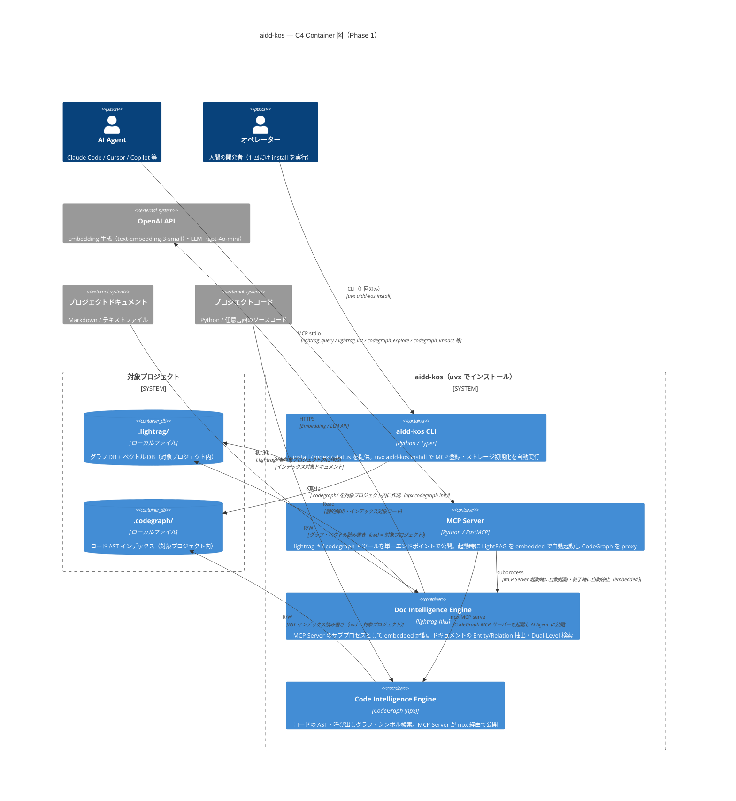

# アーキテクチャ基盤（ArchitectureBaseline）

| 項目 | 内容 |
|------|------|
| バージョン | 1.0.0 |
| 作成日 | 2026-06-03 |
| 技術スタック | Python 3.12 / FastMCP / LightRAG / Typer / CodeGraph |
| SRE レビュー完了日 | 2026-06-03 |
| 対象 Phase | Phase 1（Core MVP）|

## C4 Container 図

C4 Model Level 2: Container 図（Phase 1 目標構成）

> **インストールフロー:** 対象プロジェクトのルートで `uvx aidd-kos install` を実行すると、
> .lightrag/ + .codegraph/ を対象プロジェクト内に初期化し、~/.claude/settings.json に MCP 登録する。



### Phase 2〜 への拡張

Phase 1 で LightRAG（ドキュメント）+ CodeGraph（コード）の 2 エンジンを確立した後、
Phase 2 では第 3・第 4 のエンジンを追加実装する。

```text
[AI Agent]
    ↓ MCP stdio
[MCP Server (FastMCP)]
    ↓ (Agent が選択)
+-----------------------------------+
|  Doc Intelligence (LightRAG)      |  ← Phase 1
|  Code Intelligence (CodeGraph)    |  ← Phase 1
|  Engine 3 (ADR 検索等)             |  ← Phase 2
|  Engine N                         |  ← Phase 3〜
+-----------------------------------+
```

## MCP Aggregator パターン

aidd-kos の MCP Server は **MCP Aggregator** として実装する。

```text
AI Agent
    ↓ MCP stdio（aidd-kos 1本のみ登録）
MCP Server（FastMCP + Aggregator）
    ├─ lightrag_* ツール  ← LightRAG embedded サブプロセスを直接実装
    ├─ codegraph_* ツール ← CodeGraph npx プロセスを proxy
    └─ kos_status         ← 全エンジンの統合ステータス
```

**実装方針（FastMCP 2.x）:**

- LightRAG ツール（`lightrag_query` / `lightrag_list`）: FastMCP の `@app.tool()` で直接実装。HTTP で embedded LightRAG を呼ぶ
- CodeGraph ツール（`codegraph_*`）: FastMCP の process proxy 機能で `npx @colbymchenry/codegraph serve` を束ねる
- 将来エンジン: 同パターンで追加。AI Agent 側の設定変更は不要

## レイヤー構成

採用パターン: **レイヤードアーキテクチャ**（Presentation → Application → Domain → Infrastructure）

| レイヤー | 責務 | 現実装モジュール | 依存先 | 禁止依存 |
|--------|------|--------------|--------|---------|
| **Interface Layer**（インターフェース層） | MCP ツール公開（FastMCP）・CLI コマンド（Typer）。入出力変換のみ、ビジネスロジックなし | `mcp_server/server.py`（MCP）、`aidd_kos/cli.py`（未実装） | Application Layer | Domain / Infrastructure への直接アクセス禁止 |
| **Application Layer**（アプリケーション層） | クエリ統括・インデックス管理。サーバーライフサイクルは MCP Server が担う（embedded） | `scripts/index.py`、`scripts/status.py`、`aidd_kos/install.py`（未実装） | Knowledge Engine Layer | Infrastructure への直接アクセス禁止 |
| **Knowledge Engine Layer**（ナレッジエンジン層） | Doc Intelligence（LightRAG）・Code Intelligence（CodeGraph）の知識処理・検索・グラフ操作 | LightRAG REST API（外部プロセス）、CodeGraph（外部プロセス） | Infrastructure Layer | Interface / Application への逆依存禁止 |
| **Infrastructure Layer**（インフラ層） | OpenAI API クライアント・LightRAG REST API クライアント・ファイルシステムアクセス | `httpx`（LightRAG HTTP）、`urllib.request`（LightRAG REST）、LightRAG 内部 OpenAI クライアント | 外部サービス（OpenAI API / ファイルシステム） | 上位レイヤーへの逆依存禁止 |

> **注記（N-5）:** 現 Phase 1 実装では Interface Layer が直接 Infrastructure（httpx 経由の LightRAG REST API）を
> 呼び出しており Application Layer が薄い。Phase 2 のエンジン追加時にリファクタリングを実施する。

## 依存方向ルール

```text
Interface Layer
    ↓（呼び出し可）
Application Layer
    ↓（呼び出し可）
Knowledge Engine Layer
    ↓（呼び出し可）
Infrastructure Layer
    ↓（呼び出し可）
外部サービス（OpenAI API / ファイルシステム）
```

- **逆方向依存（↑）は禁止**。下位レイヤーは上位レイヤーを知らない
- Knowledge Engine Layer（LightRAG / CodeGraph）は外部プロセスとして動作するため、Application Layer はプロセス間通信（HTTP / npx CLI）でのみ呼び出す

## 既知の技術的負債（SRE レビュー指摘）

| ID | 指摘 | 場所 | 対処方針 |
|----|------|------|---------|
| ~~TD-01~~ | ~~httpx タイムアウト NFR 乖離~~ | ✅ 解消済み（Epic #2 F-01）| `LIGHTRAG_QUERY_TIMEOUT_MS` env + `QUERY_TIMEOUT` エラーを実装 |
| ~~TD-02~~ | ~~MCP エラー時の stderr 出力未実装~~ | ✅ 解消済み（Epic #2 F-01）| `emit_error()` による stderr 出力を全エラーパスに実装 |
| TD-03 | インデックスの二重書き込み経路（REST API / Python API 直接）による競合リスク。サーバー起動中の Python API 経路はインデックス破損の可能性 | `scripts/index.py` L100-117 | サーバー起動中は Python API 直接経路を禁止（`sys.exit(1)` で明示失敗）し、ADR として設計判断を記録。Phase 2 前に対応 |
| TD-04 | `aidd-kos` CLI（Typer）が未実装。`pyproject.toml` にエントリポイントなし | `pyproject.toml` | Phase 1 完了条件。`aidd_kos/cli.py` を新規作成（install / index / status）し `pyproject.toml` にエントリポイントを登録する |
| TD-05 | LightRAG の embedded 起動（サブプロセス管理）が未実装。現状は外部プロセスを手動起動 | `mcp_server/server.py` | Phase 1 完了条件。MCP Server の lifespan フックで LightRAG サブプロセスを起動・ヘルスチェック・終了させる |
| TD-06 | `.lightrag/` のストレージ先が aidd-kos 自身のディレクトリ（`PROJECT_ROOT`）になっており対象プロジェクトに配置されていない | `scripts/index.py` L12、`mcp_server/server.py` 環境変数 | Phase 1 完了条件。`AIDD_KOS_PROJECT_DIR` 環境変数で対象プロジェクトのパスを受け取り、`WORKING_DIR` を対象プロジェクト内の `.lightrag/` に変更する |
| TD-07 | `aidd-kos install` コマンドが未実装。~/.claude/settings.json への MCP 登録・ストレージ初期化・.gitignore 更新を自動化する必要がある | 未実装 | Phase 1 完了条件。`aidd_kos/install.py` を実装し `aidd-kos install` コマンドとして公開する |

## Analysis Notes

### 確認したファイル

| ファイル | 確認内容 |
|---------|---------|
| `docs/PROJECT-CHARTER.md` | §9 アーキテクチャ方針・§10 技術スタック・NFR を取得 |
| `mcp_server/server.py` | MCP ツール定義・httpx タイムアウト・エラーハンドリングを確認 |
| `scripts/index.py` | インデックス二重経路・忽視パターンを確認 |
| `scripts/server.py` | LightRAG サーバー起動・PID 管理を確認 |
| `Taskfile.yml` | codegraph:* タスク・lightrag:* タスクが既に実装済みであることを確認 |
| `pyproject.toml` | 依存パッケージ・エントリポイントを確認 |

### 存在しないファイル

- `aidd-framework/conventions/python.md` — Python 固有の規約ファイルなし。フレームワーク共通規約を適用
- `docs/domain/bounded-contexts.md` — ドメイン設計未定義
- `docs/architecture/adr/` — ADR 未作成（.gitkeep のみ）
- `docs/project-conventions/overrides.md` — プロジェクト固有規約オーバーライドなし
- `aidd_kos/cli.py` — CLI 未実装（Phase 1 完了条件）

### SRE レビュー結果サマリー

- **Critical 4件**: C-1（CodeGraph の C4 図追加）→ 反映済み。C-2/C-3/C-4 → 技術的負債 TD-01〜03 として記録、Phase 1 完了前に対応
- **Non-critical 7件**: N-1〜N-7 → 将来の Epic 設計・ADR 作成時に対応

### 設計上の仮定

- LightRAG は MCP Server のサブプロセス（embedded）として動作し、REST API 経由でのみアクセスする。排他制御は LightRAG サーバー側に委譲
- CodeGraph は Phase 1 MVP で AI Agent への MCP 公開まで完結する（Phase 2 待ちではない）
- `.lightrag/` と `.codegraph/` は**対象プロジェクトのルート**に配置する。aidd-kos 自身のディレクトリには保存しない
- `aidd-kos install` は対象プロジェクトの cwd を基準に MCP server の環境変数（`AIDD_KOS_PROJECT_DIR`）を設定する
- OpenAI API のリトライは LightRAG 内部実装に委譲（外部ライブラリのため確認不可）

## 参照 ADR

現時点で ADR は未作成。以下の設計判断は ADR 化候補：

| 番号 | テーマ |
|------|--------|
| [ADR-001](./adr/ADR-001-error-code-convention.md) | aidd-kos エラーコード体系の統一設計（`{COMPONENT}_{ERROR_TYPE}` 形式）|
| [ADR-002](./adr/ADR-002-fastmcp-process-proxy.md) | FastMCP process proxy による CodeGraph MCP 統合方式（`NpxStdioTransport` + `mount(namespace="codegraph")`）|
| ADR-003（候補）| LightRAG 採用理由（GraphRAG / Repomix との比較）|
| ADR-004（候補）| インデックス書き込み経路の排他制御方針（TD-03 対応）|
| ADR-005（候補）| Embedding プロバイダー戦略（OpenAI only → 将来の拡充）|
